# ipm_boot

####  编码规范

- 规范方式：严格遵守阿里编码规约。
- 命名统一：简介最大程度上达到了见名知意。
- 分包明确：层级分明可快速定位到代码位置。
- 注释完整：描述性高大量减少了开发人员的代码阅读工作量。
- 工具规范：使用统一jar包避免出现内容冲突。
- 代码整洁：可读性、维护性高。

#### 前端技术：

* jQuery Version: 1.10.2
* jQuery UI - Version: 1.9.2
* jquery.jeBox Version: 1.6 
* jQuery.jeDate Version: 6.0.0
* jquery.dad Version: 1
* jqeury.mosewheel Version: 3.1.9
* jQuery Gridly Version: 1.6.3
* jQuery.jsPlumb Version: 1.62
* jtopo Version:0.4.8
* Highcharts Version:6.0.2
* Bootstrap Version: 3.1.1
* Bootstrap-select Version: 1.12.4
* Bootstrap-select-cn Version: 1.12.4
* Bootstrap-table version: 1.11.1
* Bootstrap-table-zh-CN
* Bootstrap-table-export
* HTML5Shiv Version: 3.7.2 
* Respond.js Version: 1.4.2
* d3 Version:4
* tableExport
* chosen
* icheck
* select
* Highcharts.until 自写二次封装插件
* d3graph 自写二次封装插件
* Bootstrap.table.until 自写二次封装插件
* shrink 自写表单伸缩功能插件
* header 自写头部功能插件
* sidebar 自写左侧边栏插件
* timeStamp 自写时间戳相互转换插件

#### 部分页面效果

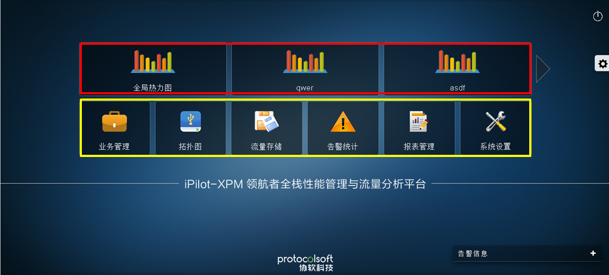

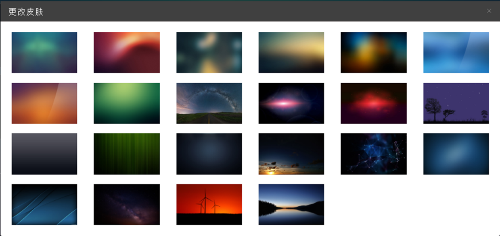

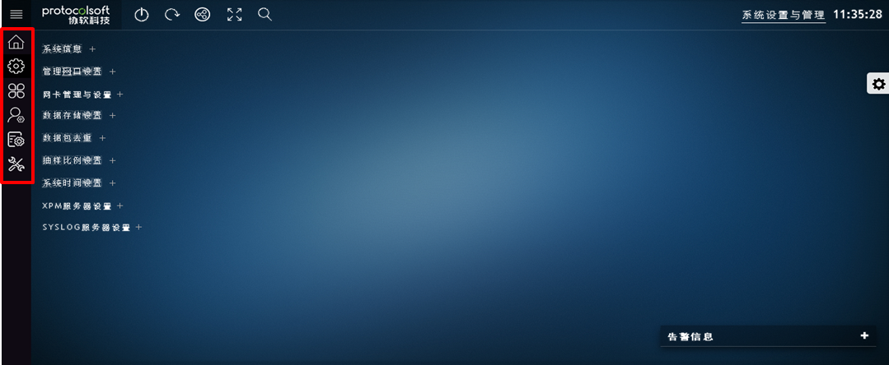

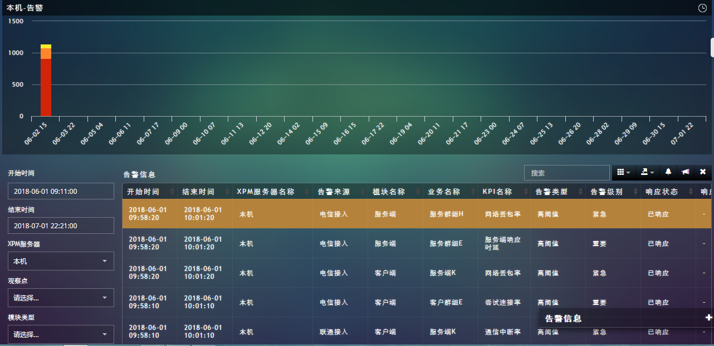

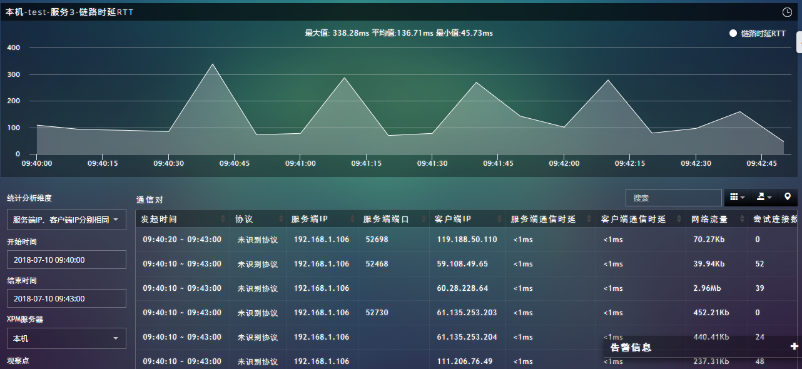

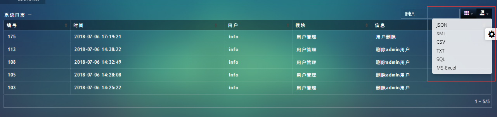

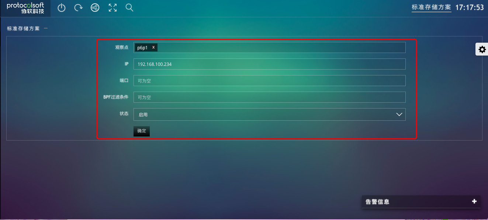

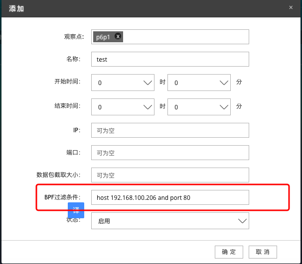

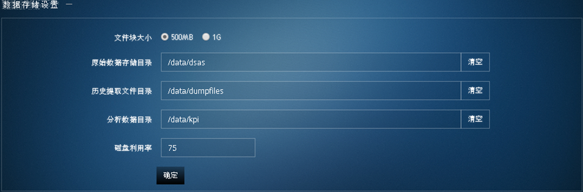

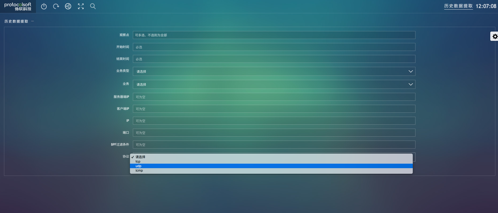

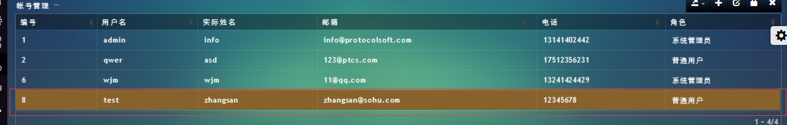

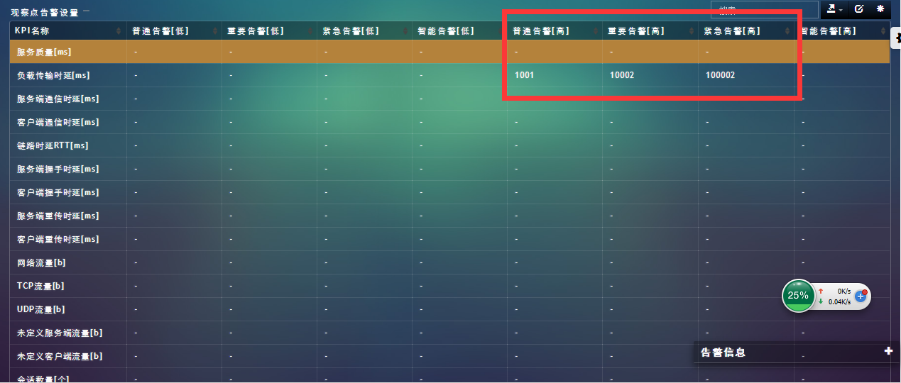

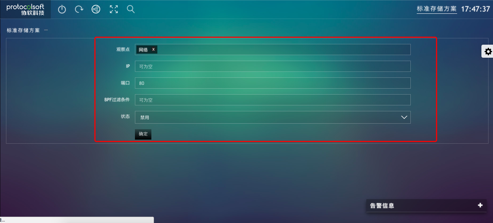

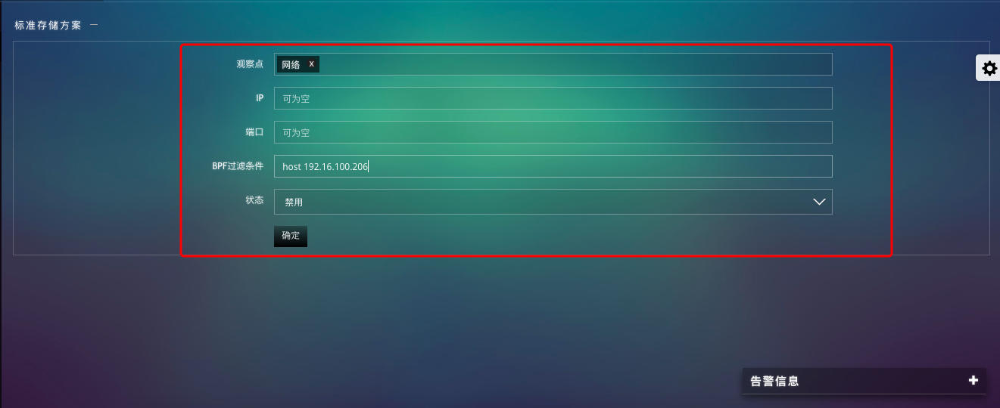

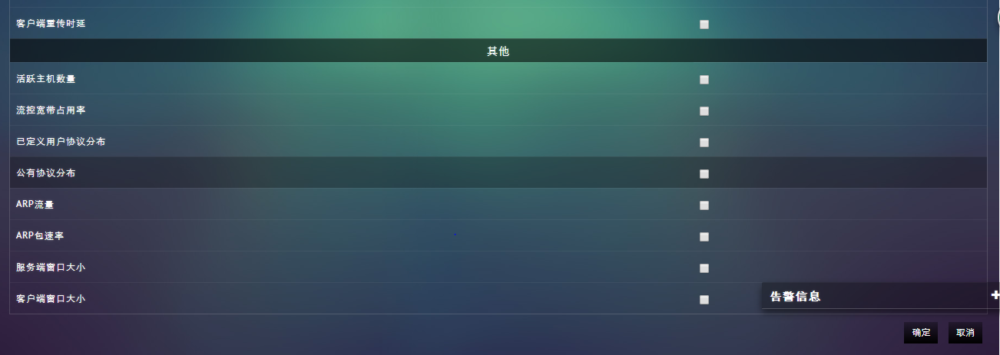

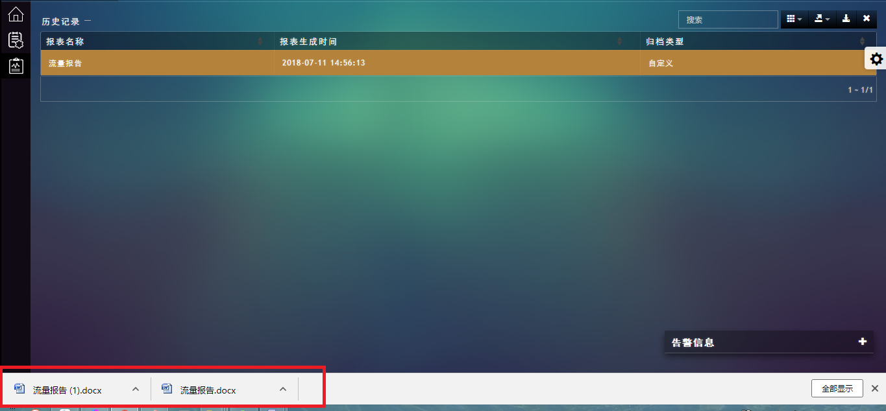

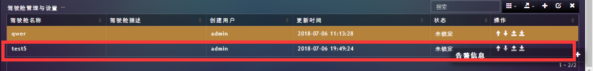

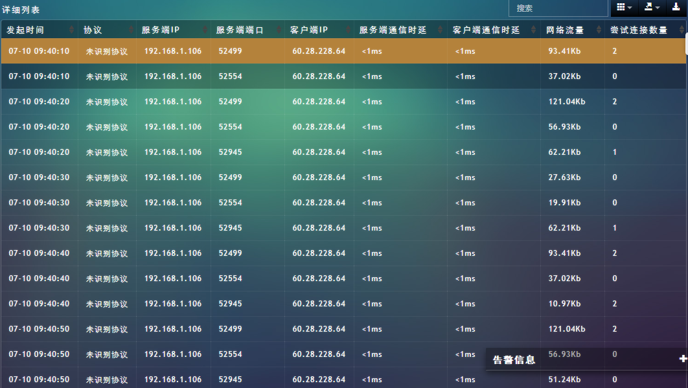

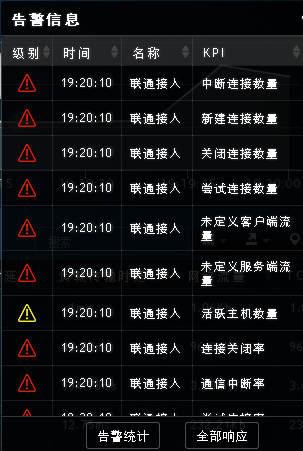

+ 拓朴图 

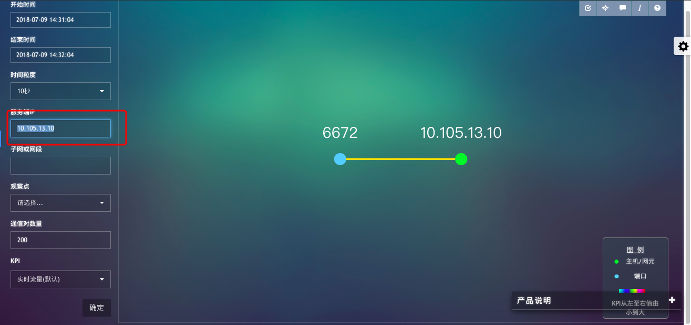

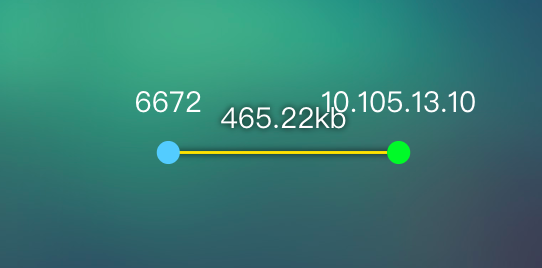

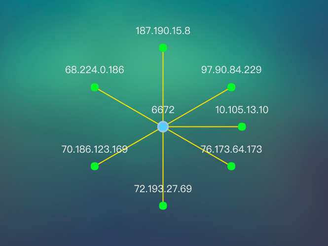

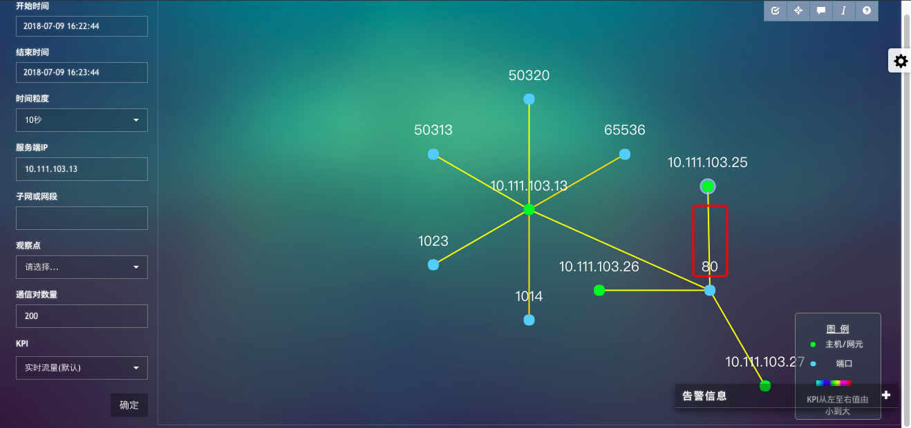

+ [用d3实现的拓朴图示意图](https://gitee.com/d3Object/d3ForceDemo)

[项目地址](http://175.102.15.166/)
