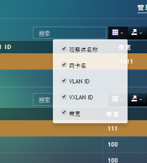
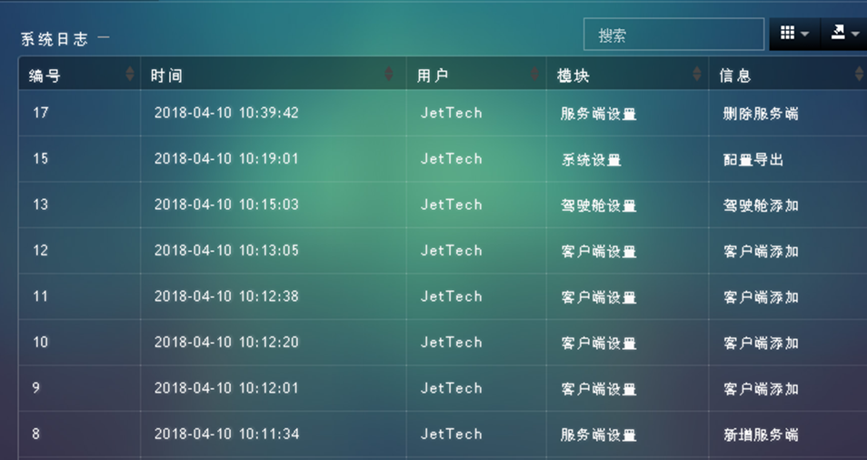

<p align="center">
    <a href='https://docs.oracle.com/en/java/javase/8'></a>
    <a href='https://docs.spring.io/spring-boot/docs/2.6.2-SNAPSHOT/reference/html'></a>
    <a href='https://staging-cn.vuejs.org'></a><br/>
    <a href='#'></a>
    <a href='#'></a>
    <a href='#'></a>
    <a href='#'></a>
</p>

# ipm_boot

### 开发环境

+ Windows

### 配置环境

| 程序           | 版本        | 说明                       |
|--------------|-----------|--------------------------|
| Jdk          | 1.8.0 161 | Java 开发工具包               |
| Mysql        | 5.5.27    | 关系型数据库                   |
| Apache-maven | 3.9.0     | Java 项目管理和构建工具           |
| Nvm          | 1.10      | Node.js 版本管理器            |
| Node         | 8.12.0    | Node.js JavaScript 运行时环境 |

### 开发工具

| 工具                       | 版本            | 说明                      |
|--------------------------|---------------|-------------------------|
| Eclipse                  | 2022.3.2      | 后前端开发IDE                |
| Git                      | 2.24.1        | 代码托管平台                  |
| Google   Chrome          | 75.0.3770.100 | 浏览器、前端调试工具              |
| Navicat                  | 11.1.13       | 数据库连接工具                 |
| Postman                  | 7.1.0         | 接口测试工具                  |
| VMware   Workstation Pro | 14.1.3        | 虚拟机(未用到或许你会用到)          |
| PowerDesigner            | 15            | 数据库设计工具(未用到或许你会用到)      |
| SQLyog                   | 12.0.3        | 数据库连接工具 (未用到或许你会用到)     |
| Visio                    | 2013          | 时序图、流程图等绘制工具(未用到或许你会用到) |
| ProcessOn                | ——            | 架构图等绘制工具(未用到或许你会用到)     |
| XMind   ZEN              | 9.2.0         | 思维导图绘制工具(未用到或许你会用到)     |
| RedisDesktop             | 0.9.3.817     | redis客户端连接工具(未用到或许你会用到) |

###  编码规范

- 规范方式：严格遵守阿里编码规约。
- 命名统一：简介最大程度上达到了见名知意。
- 分包明确：层级分明可快速定位到代码位置。
- 注释完整：描述性高大量减少了开发人员的代码阅读工作量。
- 工具规范：使用统一jar包避免出现内容冲突。
- 代码整洁：可读性、维护性高。

### 包结构

```
+- ipm_boot -- 整个项目
|   +- .checkstyle -- 用于配置和定义代码风格规范，以确保代码符合特定的规范。
|   +- .classpath -- Eclipse IDE 使用的项目类路径配置文件，定义了项目中包含的所有Java类和资源的位置。
|   +- .externalToolBuilders -- 存储了 Eclipse 或其他 IDE 使用的外部构建工具的配置文件。
|   +- .git -- 包含Git版本控制系统的配置和仓库信息。这是一个版本控制系统的核心文件夹。
|   +- .gitignore -- 包含需要在Git版本控制之外忽略的文件和文件夹的规则。
|   +- .gradle -- 包含Gradle构建工具的配置文件和缓存。
|   +- .idea -- 包含IntelliJ IDEA IDE的配置信息，用于存储项目特定的IDE设置。
|   +- .metadata -- 存储 Eclipse IDE 的元数据，包括工作空间的配置和其他项目相关信息。
|   +- .project -- Eclipse项目文件，包含项目的配置信息。
|   +- .settings -- 包含 Eclipse 项目特定的设置，例如编译器和构建器的设置。
|   +- .svn -- 存储 Subversion 版本控制系统的配置和仓库信息。这是 Subversion 的核心文件夹。
|   +- build.gradle -- Gradle 构建脚本，定义了项目的构建过程、依赖关系等。
|   +- doc -- 存储项目文档和配置
|   |   +- alarm协同.txt -- 告警协同文档
|   |   +- enlang-java.data -- Java语言的国际化数据文件
|   |   +- enlang-js.data -- JavaScript语言的国际化数据文件
|   |   +- iPM-DOC.xls -- iPM文档的Excel文件
|   |   +- ipm_data.sql -- iPM数据的SQL脚本
|   |   +- ipm_data_en.sql -- 英文版iPM数据的SQL脚本
|   |   +- ipm_proto_plan.sql -- iPM原型计划的SQL脚本
|   |   +- ipm_public_proto_plan.sql -- iPM公共原型计划的SQL脚本
|   |   +- ipm_table.sql -- iPM表结构的SQL脚本
|   |   +- ip_cn.sql -- 中文版iPM数据的SQL脚本
|   |   +- npm.ndm -- Node包管理器的配置文件
|   |   +- tomcat-conf -- Tomcat服务器的配置文件
|   |   |   +- Catalina -- Tomcat的Catalina配置
|   |   |   |   +- localhost -- Tomcat的localhost配置
|   |   |   +- catalina.policy -- Tomcat的安全策略配置
|   |   |   +- catalina.properties -- Tomcat的属性配置
|   |   |   +- context.xml -- Tomcat的上下文配置
|   |   |   +- logging.properties -- Tomcat的日志配置
|   |   |   +- server.xml -- Tomcat的服务器配置
|   |   |   +- tomcat-users.xml -- Tomcat的用户配置
|   |   |   +- tomcat-users.xsd -- Tomcat的用户配置模式
|   |   |   +- tomcat.keystore -- Tomcat的密钥库
|   |   |   +- web.xml -- Tomcat的Web应用配置
|   |   +- webdeb-conf -- Web开发配置
|   |   |   +- control -- Web开发控制配置
|   |   |   +- postinst -- Web开发安装配置
|   |   +- xr_checkstyle.xml -- 用于配置和定义代码风格规范，以确保代码符合特定的规范。
|   |   +- 告警设置接口与格式说明.docx -- 告警设置接口和格式说明文档
|   |   +- 智能告警比率类基线展示对接说明.docx -- 智能告警比率类基线展示对接说明文档
|   |   +- 通信对说明.txt -- 通信对说明文档
|   |   +- 项目变动需要协调内容 -- 项目变动需要协调的内容文档
|   +- dolphin.sh -- Dolphin脚本文件
|   +- enlang.sh -- enlang脚本文件
|   +- gradle -- Gradle构建工具的相关文件夹
|   |   +- wrapper -- 包含Gradle Wrapper的配置
|   |   |   +- gradle-wrapper.jar -- Gradle Wrapper的JAR文件
|   |   |   +- gradle-wrapper.properties -- Gradle Wrapper的配置属性文件
|   +- gradlew -- 用于在Unix系统上运行Gradle Wrapper的脚本
|   +- gradlew.bat -- 用于在Windows系统上运行Gradle Wrapper的批处理文件
|   +- ipm_boot.iml -- IntelliJ IDEA项目文件，包含项目的配置信息
|   +- ipm_new.iml -- IntelliJ IDEA项目文件，包含新项目的配置信息
|   +- LICENSE -- 项目的许可证文件
|   +- pack.sh -- 打包脚本文件
|   +- pom.xml -- Maven项目配置文件
|   +- README.md -- 项目的README文档
|   +- src
|   |   +- main
|   |   |   +- java
|   |   |   |   +- com
|   |   |   |   |   +- protocolsoft
|   |   |   |   |   |   +- alarm
|   |   |   |   |   |   |   +- bean -- 存储告警相关的Java bean类
|   |   |   |   |   |   |   |   +- AlarmAlgorithmBean.java -- 告警算法的Java bean
|   |   |   |   |   |   |   |   +- AlarmBaseLineBean.java -- 告警基线的Java bean
|   |   |   |   |   |   |   |   +- AlarmBaseLineUseDaoBean.java -- 使用DAO的告警基线的Java bean
|   |   |   |   |   |   |   |   +- AlarmCheckCountBean.java -- 告警检查计数的Java bean
|   |   |   |   |   |   |   |   +- AlarmColumnBean.java -- 告警列的Java bean
|   |   |   |   |   |   |   |   +- AlarmColumnDataBean.java -- 告警列数据的Java bean
|   |   |   |   |   |   |   |   +- AlarmColumnDetailBean.java -- 告警列详情的Java bean
|   |   |   |   |   |   |   |   +- AlarmColumnTimeLineBean.java -- 告警列时间线的Java bean
|   |   |   |   |   |   |   |   +- AlarmColumnXLineBean.java -- 告警列X轴线的Java bean
|   |   |   |   |   |   |   |   +- AlarmCustomkpiBean.java -- 自定义KPI的Java bean
|   |   |   |   |   |   |   |   +- AlarmCustomkpigroupBean.java -- 自定义KPI组的Java bean
|   |   |   |   |   |   |   |   +- AlarmCustomUnionKpiBean.java -- 自定义联合KPI的Java bean
|   |   |   |   |   |   |   |   +- AlarmCustomUnionKpiThreadBean.java -- 自定义联合KPI线程的Java bean
|   |   |   |   |   |   |   |   +- AlarmEmailSendBean.java -- 告警邮件发送的Java bean
|   |   |   |   |   |   |   |   +- AlarmGlobalSetBean.java -- 告警全局设置的Java bean
|   |   |   |   |   |   |   |   +- AlarmGlobalValueBean.java -- 告警全局值的Java bean
|   |   |   |   |   |   |   |   +- AlarmKpiAlgorithmBean.java -- 告警KPI算法的Java bean
|   |   |   |   |   |   |   |   +- AlarmKpiBean.java -- 告警KPI的Java bean
|   |   |   |   |   |   |   |   +- AlarmLevelBean.java -- 告警级别的Java bean
|   |   |   |   |   |   |   |   +- AlarmLogBean.java -- 告警日志的Java bean
|   |   |   |   |   |   |   |   +- AlarmLogFindParamBean.java -- 告警日志查询参数的Java bean
|   |   |   |   |   |   |   |   +- AlarmNoticeSetBean.java -- 告警通知设置的Java bean
|   |   |   |   |   |   |   |   +- AlarmPieBean.java -- 告警饼图的Java bean
|   |   |   |   |   |   |   |   +- AlarmPieColumnBean.java -- 告警饼图列的Java bean
|   |   |   |   |   |   |   |   +- AlarmRemoveRedundancyBlBean.java -- 告警移除冗余基线的Java bean
|   |   |   |   |   |   |   |   +- AlarmSetBean.java -- 告警设置的Java bean
|   |   |   |   |   |   |   |   +- AlarmSetDataBean.java -- 告警设置数据的Java bean
|   |   |   |   |   |   |   |   +- AlarmSetTitleBean.java -- 告警设置标题的Java bean
|   |   |   |   |   |   |   |   +- AlarmSysLogBean.java -- 告警系统日志的Java bean
|   |   |   |   |   |   |   |   +- AlarmThreadInsertBean.java -- 告警线程插入的Java bean
|   |   |   |   |   |   |   |   +- AlarmThreshBean.java -- 告警阈值的Java bean
|   |   |   |   |   |   |   |   +- AlarmThreshSetBean.java -- 告警阈值设置的Java bean
|   |   |   |   |   |   |   |   +- AlarmTriggerBean.java -- 告警触发的Java bean
|   |   |   |   |   |   |   |   +- AlarmTypeBean.java -- 告警类型的Java bean
|   |   |   |   |   |   |   |   +- AlarmUseDaoBean.java -- 使用DAO的告警的Java bean
|   |   |   |   |   |   |   |   +- PointEntryByAlarmTypeBean.java -- 基于告警类型的点入口的Java bean
|   |   |   |   |   |   |   +- controller -- 存储告警相关的Java控制器类
|   |   |   |   |   |   |   |   +- AlarmCustomUnionKpiController.java -- 告警自定义联合KPI的控制器类
|   |   |   |   |   |   |   |   +- AlarmLogController.java -- 告警日志的控制器类
|   |   |   |   |   |   |   |   +- AlarmNoticeSetController.java -- 告警通知设置的控制器类
|   |   |   |   |   |   |   |   +- AlarmSetController.java -- 告警设置的控制器类
|   |   |   |   |   |   |   +- dao -- 存储告警相关的Java数据访问对象类
|   |   |   |   |   |   |   |   +- AlarmAlgorithmDao.java -- 告警算法的数据访问对象类
|   |   |   |   |   |   |   |   +- AlarmBaseLineDao.java -- 告警基线的数据访问对象类
|   |   |   |   |   |   |   |   +- AlarmCustomkpiDao.java -- 告警自定义KPI的数据访问对象类
|   |   |   |   |   |   |   |   +- AlarmCustomUnionKpiDao.java -- 告警自定义联合KPI的数据访问对象类
|   |   |   |   |   |   |   |   +- AlarmGlobalSetDao.java -- 告警全局设置的数据访问对象类
|   |   |   |   |   |   |   |   +- AlarmGlobalValueDao.java -- 告警全局值的数据访问对象类
|   |   |   |   |   |   |   |   +- AlarmKpiAlgorithmDao.java -- 告警KPI算法的数据访问对象类
|   |   |   |   |   |   |   |   +- AlarmKpiDao.java -- 告警KPI的数据访问对象类
|   |   |   |   |   |   |   |   +- AlarmLevelDao.java -- 告警级别的数据访问对象类
|   |   |   |   |   |   |   |   +- AlarmLogDao.java -- 告警日志的数据访问对象类
|   |   |   |   |   |   |   |   +- AlarmNoticeSetDao.java -- 告警通知设置的数据访问对象类
|   |   |   |   |   |   |   |   +- AlarmSetDao.java -- 告警设置的数据访问对象类
|   |   |   |   |   |   |   |   +- AlarmSetThreadDao.java -- 告警设置线程的数据访问对象类
|   |   |   |   |   |   |   |   +- AlarmTriggerDao.java -- 告警触发的数据访问对象类
|   |   |   |   |   |   |   |   +- AlarmTypeDao.java -- 告警类型的数据访问对象类
|   |   |   |   |   |   |   +- enumeration -- 存储告警相关的Java枚举类
|   |   |   |   |   |   |   |   +- BaselineTriggerGrain.java -- 基线触发粒度的枚举类
|   |   |   |   |   |   |   |   +- BusHierarchies.java -- 公共总线层次结构的枚举类
|   |   |   |   |   |   |   +- service -- 存储告警相关的Java服务类
|   |   |   |   |   |   |   |   +- AlarmAlgorithmService.java -- 告警算法的服务类
|   |   |   |   |   |   |   |   +- AlarmCustomUnionKpiService.java -- 告警自定义联合KPI的服务类
|   |   |   |   |   |   |   |   +- AlarmKpisService.java -- 告警KPI的服务类
|   |   |   |   |   |   |   |   +- AlarmLogService.java -- 告警日志的服务类
|   |   |   |   |   |   |   |   +- AlarmNoticeSetService.java -- 告警通知设置的服务类
|   |   |   |   |   |   |   |   +- AlarmSetService.java -- 告警设置的服务类
|   |   |   |   |   |   |   |   +- AlarmTriggerService.java -- 告警触发的服务类
|   |   |   |   |   |   |   |   +- AlarmTypeService.java -- 告警类型的服务类
|   |   |   |   |   |   |   +- task -- 存储告警相关的Java任务类
|   |   |   |   |   |   |   |   +- AlarmLoopDelTask.java -- 告警循环删除任务类
|   |   |   |   |   |   |   +- thread -- 存储告警相关的Java线程类
|   |   |   |   |   |   |   |   +- AlarmSetMinuteBLRunAble.java -- 告警设置分钟基线运行类
|   |   |   |   |   |   |   |   +- AlarmSetMinuteRunAble.java -- 告警设置分钟运行类
|   |   |   |   |   |   |   |   +- AlarmSetSecondBLRunAble.java -- 告警设置秒基线运行类
|   |   |   |   |   |   |   |   +- AlarmSetSecondRunAble.java -- 告警设置秒运行类
|   |   |   |   |   |   |   |   +- AlarmThreadPool.java -- 告警线程池类
|   |   |   |   |   |   |   +- util -- 存储告警相关的Java工具类
|   |   |   |   |   |   |   |   +- AlarmAlgorithmBaseLineUtil.java -- 告警算法基线工具类
|   |   |   |   |   |   |   |   +- AlarmAlgorithmUtil.java -- 告警算法工具类
|   |   |   |   |   |   |   |   +- AlarmBaseLineCalculateUtil.java -- 告警基线计算工具类
|   |   |   |   |   |   |   |   +- AlarmBaseLineDaoUsedUtil.java -- 使用DAO的告警基线工具类
|   |   |   |   |   |   |   |   +- AlarmBaseLineRrdInitCreateUtil.java -- 告警基线RRD初始化创建工具类
|   |   |   |   |   |   |   |   +- AlarmBaseLineStepSaveMaxTimeUtil.java -- 告警基线步骤保存最大时间工具类
|   |   |   |   |   |   |   |   +- AlarmConstantUtil.java -- 告警常量工具类
|   |   |   |   |   |   |   |   +- AlarmCustomUnionKpiUtil.java -- 告警自定义联合KPI工具类
|   |   |   |   |   |   |   |   +- AlarmLogFindParamBeanUtil.java -- 告警日志查询参数工具类
|   |   |   |   |   |   |   |   +- AlarmLogUtil.java -- 告警日志工具类
|   |   |   |   |   |   |   |   +- AlarmMinuteBusiBaseLineUtil.java -- 告警分钟业务基线工具类
|   |   |   |   |   |   |   |   +- AlarmMinuteUrlBaseLineUtil.java -- 告警分钟URL基线工具类
|   |   |   |   |   |   |   |   +- AlarmNeedSystemInfo.java -- 告警需要的系统信息类
|   |   |   |   |   |   |   |   +- AlarmRedundanceDelUtil.java -- 告警冗余删除工具类
|   |   |   |   |   |   |   |   +- AlarmSecondBaseLineUtil.java -- 告警秒基线工具类
|   |   |   |   |   |   |   |   +- AlarmSetBaseLineToMemoryUtil.java -- 告警设置基线到内存工具类
|   |   |   |   |   |   |   |   +- AlarmSetDelBaseLineUtil.java -- 告警设置删除基线工具类
|   |   |   |   |   |   |   |   +- AlarmSetThreadUtil.java -- 告警设置线
|   |   |   |   |   |   |   |   +- AlarmSyslogUtil.java -- 告警系统日志工具类
|   |   |   |   |   |   |   |   +- AlarmThreadInsertUtil.java -- 告警线程插入工具类
|   |   |   |   |   |   |   |   +- AlarmValueSetToMemoryUtil.java -- 告警值集合到内存工具类
|   |   |   |   |   |   |   |   +- MaxThreadAlgorithm.java -- 最大线程算法类
|   |   |   |   |   |   +- app -- 存储应用相关的Java包
|   |   |   |   |   |   |   +- bean -- 存储应用相关的Java bean类
|   |   |   |   |   |   |   |   +- AlarmDataBean.java -- 告警数据的bean类
|   |   |   |   |   |   |   |   +- AppSessionBean.java -- 应用会话的bean类
|   |   |   |   |   |   |   |   +- AppTopConfigBean.java -- 应用顶部配置的bean类
|   |   |   |   |   |   |   |   +- AppTopParamsBean.java -- 应用顶部参数的bean类
|   |   |   |   |   |   |   |   +- DBSessionBean.java -- 数据库会话的bean类
|   |   |   |   |   |   |   |   +- HeatmapDataBean.java -- 热图数据的bean类
|   |   |   |   |   |   |   |   +- HttpSessionBean.java -- HTTP会话的bean类
|   |   |   |   |   |   |   |   +- ParamBean.java -- 参数的bean类
|   |   |   |   |   |   |   |   +- PlotBean.java -- 绘图的bean类
|   |   |   |   |   |   |   |   +- PlotDataBean.java -- 绘图数据的bean类
|   |   |   |   |   |   |   |   +- PlotParamBean.java -- 绘图参数的bean类
|   |   |   |   |   |   |   |   +- PlotSimpleBean.java -- 简单绘图的bean类
|   |   |   |   |   |   |   |   +- PointDataBean.java -- 点数据的bean类
|   |   |   |   |   |   |   |   +- SessionParamsBean.java -- 会话参数的bean类
|   |   |   |   |   |   |   |   +- SimpleDataBean.java -- 简单数据的bean类
|   |   |   |   |   |   |   |   +- SimpleParamBean.java -- 简单参数的bean类
|   |   |   |   |   |   |   |   +- TableParamBean.java -- 表格参数的bean类
|   |   |   |   |   |   |   +- controller -- 存储应用相关的Java控制器类
|   |   |   |   |   |   |   |   +- AppController.java -- 应用控制器类
|   |   |   |   |   |   |   +- dao -- 存储应用相关的Java数据访问对象类
|   |   |   |   |   |   |   |   +- AppDao.java -- 应用数据访问对象类
|   |   |   |   |   |   |   |   +- AppTopDao.java -- 应用顶部数据访问对象类
|   |   |   |   |   |   |   +- enumeration -- 存储应用相关的Java枚举类
|   |   |   |   |   |   |   |   +- AppTableType.java -- 应用表格类型的枚举类
|   |   |   |   |   |   |   +- provider -- 存储应用相关的Java提供者类
|   |   |   |   |   |   |   |   +- AppProvider.java -- 应用提供者类
|   |   |   |   |   |   |   |   +- AppTopProvider.java -- 应用顶部提供者类
|   |   |   |   |   |   |   +- service -- 存储应用相关的Java服务类
|   |   |   |   |   |   |   |   +- AppService.java -- 应用服务类
|   |   |   |   |   |   |   |   +- AppTopService.java -- 应用顶部服务类
|   |   |   |   |   |   |   |   +- TopThread.java -- 顶部线程类
|   |   |   |   |   |   +- common -- 存储通用模块相关的Java包
|   |   |   |   |   |   |   +- bean -- 存储通用模块相关的Java bean类
|   |   |   |   |   |   |   |   +- AlarmHeatmapBean.java -- 告警热图的bean类
|   |   |   |   |   |   |   |   +- AppBusinessBean.java -- 应用业务的bean类
|   |   |   |   |   |   |   |   +- CenterIpBean.java -- 中心IP的bean类
|   |   |   |   |   |   |   |   +- CenterParamBean.java -- 中心参数的bean类
|   |   |   |   |   |   |   |   +- DrawingOptionsBean.java -- 绘图选项的bean类
|   |   |   |   |   |   |   |   +- Heatmap.java -- 热图类
|   |   |   |   |   |   |   |   +- HeatmapBlock.java -- 热图块类
|   |   |   |   |   |   |   |   +- HeatSimpleBean.java -- 简单热图的bean类
|   |   |   |   |   |   |   |   +- ReportListBean.java -- 报告列表的bean类
|   |   |   |   |   |   |   |   +- SaasUserBean.java -- Saas用户的bean类
|   |   |   |   |   |   |   |   +- SameIpPortParamBean.java -- 相同IP和端口参数的bean类
|   |   |   |   |   |   |   +- controller -- 存储通用模块相关的Java控制器类
|   |   |   |   |   |   |   |   +- CenterIpController.java -- 中心IP控制器类
|   |   |   |   |   |   |   |   +- CommonController.java -- 通用控制器类
|   |   |   |   |   |   |   |   +- JsonConfigController.java -- JSON配置控制器类
|   |   |   |   |   |   |   |   +- SaasUserController.java -- Saas用户控制器类
|   |   |   |   |   |   |   +- dao -- 存储通用模块相关的Java数据访问对象类
|   |   |   |   |   |   |   |   +- AppBusinessDao.java -- 应用业务数据访问对象类
|   |   |   |   |   |   |   |   +- CenterIpDao.java -- 中心IP数据访问对象类
|   |   |   |   |   |   |   |   +- SaasUserDao.java -- Saas用户数据访问对象类
|   |   |   |   |   |   |   +- enumeration -- 存储通用模块相关的Java枚举类
|   |   |   |   |   |   |   |   +- ServiceRuleType.java -- 服务规则类型的枚举类
|   |   |   |   |   |   |   +- listener -- 存储通用模块相关的Java监听器类
|   |   |   |   |   |   |   |   +- ThreadPoolListener.java -- 线程池监听器类
|   |   |   |   |   |   |   +- provider -- 存储通用模块相关的Java提供者类
|   |   |   |   |   |   |   |   +- AppBusinessProvider.java -- 应用业务提供者类
|   |   |   |   |   |   |   +- service -- 存储通用模块相关的Java服务类
|   |   |   |   |   |   |   |   +- CommonService.java -- 通用服务类
|   |   |   |   |   |   |   |   +- impl -- 存储通用模块相关的Java服务实现类
|   |   |   |   |   |   |   |   |   +- AppBusinessService.java -- 应用业务服务类
|   |   |   |   |   |   |   |   |   +- CenterIpService.java -- 中心IP服务类
|   |   |   |   |   |   |   |   |   +- CommonServiceImpl.java -- 通用服务实现类
|   |   |   |   |   |   |   |   |   +- SaasUserService.java -- Saas用户服务类
|   |   |   |   |   |   |   +- task -- 存储相关任务的Java类
|   |   |   |   |   |   |   |   +- SaasuserCenterTask.java -- Saas用户中心任务类
|   |   |   |   |   |   +- commpair -- 存储通信对模块相关的Java包
|   |   |   |   |   |   |   +- bean -- 存储通信对模块相关的Java bean类
|   |   |   |   |   |   |   |   +- CommpairAreaDictBean.java -- 通信对区域字典的bean类
|   |   |   |   |   |   |   |   +- CommpairBean.java -- 通信对的bean类
|   |   |   |   |   |   |   |   +- CommpairFindParamBean.java -- 通信对查找参数的bean类
|   |   |   |   |   |   |   |   +- CommpairFlowReturnBean.java -- 通信对流返回的bean类
|   |   |   |   |   |   |   |   +- CommpairPropellingBean.java -- 通信对推送的bean类
|   |   |   |   |   |   |   |   +- CommpairServerFlowNameItemBean.java -- 通信对服务器流名称项的bean类
|   |   |   |   |   |   |   |   +- CommpairServerFlowNameListBean.java -- 通信对服务器流名称列表的bean类
|   |   |   |   |   |   |   +- controller -- 存储通信对模块相关的Java控制器类
|   |   |   |   |   |   |   |   +- CommpairController.java -- 通信对控制器类
|   |   |   |   |   |   |   |   +- CommpairFlowController.java -- 通信对流控制器类
|   |   |   |   |   |   |   +- dao -- 存储通信对模块相关的Java数据访问对象类
|   |   |   |   |   |   |   |   +- CommpairAreaDictDao.java -- 通信对区域字典数据访问对象类
|   |   |   |   |   |   |   |   +- CommpairDao.java -- 通信对数据访问对象类
|   |   |   |   |   |   |   +- enumeration -- 存储通信对模块相关的Java枚举类
|   |   |   |   |   |   |   |   +- ServiceRuleType.java -- 服务规则类型的枚举类
|   |   |   |   |   |   |   +- provider -- 存储通信对模块相关的Java提供者类
|   |   |   |   |   |   |   |   +- CommpairProvider.java -- 通信对提供者类
|   |   |   |   |   |   |   +- service -- 存储通信对模块相关的Java服务类
|   |   |   |   |   |   |   |   +- CommpairFlowNewService.java -- 通信对流新服务类
|   |   |   |   |   |   |   |   +- CommpairFlowService.java -- 通信对流服务类
|   |   |   |   |   |   |   |   +- CommpairService.java -- 通信对服务类
|   |   |   |   |   |   |   +- util -- 存储通信对模块相关的Java工具类
|   |   |   |   |   |   |   |   +- CommpairFlowErrorUtil.java -- 通信对流错误工具类
|   |   |   |   |   |   |   |   +- CommpairFolderNameUtil.java -- 通信对文件夹名称工具类
|   |   |   |   |   |   |   |   +- CommpairIpLocationUtil.java -- 通信对IP位置工具类
|   |   |   |   |   |   |   |   +- CommpairProtocolUtil.java --
|   |   |   |   |   |   |   |   +- CommpairTableNameUtil.java -- 通信对表名工具类
|   |   |   |   |   |   |   |   +- CommpairWithOutKpiUtil.java -- 通信对不带KPI的工具类
|   |   |   |   |   |   +- datapush -- 存储数据推送模块相关的Java包
|   |   |   |   |   |   |   +- bean -- 存储数据推送模块相关的Java bean类
|   |   |   |   |   |   |   |   +- BusinesBean.java -- 业务bean类
|   |   |   |   |   |   |   |   +- BusinesKpiBean.java -- 业务KPI bean类
|   |   |   |   |   |   |   +- controller -- 存储数据推送模块相关的Java控制器类
|   |   |   |   |   |   |   |   +- BusiProcessingController.java -- 业务处理控制器类
|   |   |   |   |   |   |   +- dao -- 存储数据推送模块相关的Java数据访问对象类
|   |   |   |   |   |   |   |   +- BusinesDao.java -- 业务数据访问对象类
|   |   |   |   |   |   |   +- service -- 存储数据推送模块相关的Java服务类
|   |   |   |   |   |   |   |   +- BusinesService.java -- 业务服务类
|   |   |   |   |   |   |   |   +- impl -- 存储数据推送模块相关的Java服务实现类
|   |   |   |   |   |   |   |   |   +- BusinesServiceImpl.java -- 业务服务实现类
|   |   |   |   |   |   |   +- task -- 存储数据推送模块相关的Java任务类
|   |   |   |   |   |   |   |   +- CommunicationPairDataPush.java -- 通信对数据推送类
|   |   |   |   |   |   |   |   +- CommunicationPairDataTask.java -- 通信对数据任务类
|   |   |   |   |   |   |   |   +- TimerDataPushTask.java -- 定时数据推送任务类
|   |   |   |   |   |   +- depthanaly -- 存储深度分析模块相关的Java包
|   |   |   |   |   |   |   +- bean -- 存储深度分析模块相关的Java bean类
|   |   |   |   |   |   |   |   +- BusTagListBean.java -- 业务标签列表bean类
|   |   |   |   |   |   |   |   +- DeptMsgLogBean.java -- 部门消息日志bean类
|   |   |   |   |   |   |   |   +- IpmBusTagBean.java -- Ipm业务标签bean类
|   |   |   |   |   |   |   |   +- IpmMsgFixedBean.java -- Ipm固定消息bean类
|   |   |   |   |   |   |   +- controller -- 存储深度分析模块相关的Java控制器类
|   |   |   |   |   |   |   |   +- IpmBusTagController.java -- Ipm业务标签控制器类
|   |   |   |   |   |   |   +- dao -- 存储深度分析模块相关的Java数据访问对象类
|   |   |   |   |   |   |   |   +- IpmBusTagDao.java -- Ipm业务标签数据访问对象类
|   |   |   |   |   |   |   |   +- IpmMsgFixedDao.java -- Ipm固定消息数据访问对象类
|   |   |   |   |   |   |   +- provider -- 存储深度分析模块相关的Java提供者类
|   |   |   |   |   |   |   |   +- DepthProvider.java -- 深度分析提供者类
|   |   |   |   |   |   |   +- service -- 存储深度分析模块相关的Java服务类
|   |   |   |   |   |   |   |   +- impl -- 存储深度分析模块相关的Java服务实现类
|   |   |   |   |   |   |   |   |   +- IpmBusTagServiceImpl.java -- Ipm业务标签服务实现类
|   |   |   |   |   |   |   |   +- IpmBusTagService.java -- Ipm业务标签服务类
|   |   |   |   |   |   +- email -- 存储电子邮件模块相关的Java包
|   |   |   |   |   |   |   +- bean -- 存储电子邮件模块相关的Java bean类
|   |   |   |   |   |   |   |   +- EmailBean.java -- 电子邮件bean类
|   |   |   |   |   |   |   |   +- MailAuthenticatorBean.java -- 邮件认证器bean类
|   |   |   |   |   |   |   |   +- MailBean.java -- 邮件bean类
|   |   |   |   |   |   |   |   +- QywxBean.java -- 企业微信bean类
|   |   |   |   |   |   |   +- controller -- 存储电子邮件模块相关的Java控制器类
|   |   |   |   |   |   |   |   +- EmailController.java -- 电子邮件控制器类
|   |   |   |   |   |   |   |   +- QywxController.java -- 企业微信控制器类
|   |   |   |   |   |   |   +- dao -- 存储电子邮件模块相关的Java数据访问对象类
|   |   |   |   |   |   |   |   +- EmailDao.java -- 电子邮件数据访问对象类
|   |   |   |   |   |   |   +- service -- 存储电子邮件模块相关的Java服务类
|   |   |   |   |   |   |   |   +- impl -- 存储电子邮件模块
|   |   |   |   |   |   +- jtopo -- 存储jtopo模块相关的Java包
|   |   |   |   |   |   |   +- bean -- 存储jtopo模块相关的Java bean类
|   |   |   |   |   |   |   |   +- CommpairBean.java -- Commpair bean类
|   |   |   |   |   |   |   |   +- CommpairQoBean.java -- Commpair查询对象 bean类
|   |   |   |   |   |   |   |   +- CommpairTablesBean.java -- Commpair数据表bean类
|   |   |   |   |   |   |   |   +- CommpairVoBean.java -- Commpair视图bean类
|   |   |   |   |   |   |   |   +- JtopoIpnet.java -- Jtopo IP网络bean类
|   |   |   |   |   |   |   +- controller -- 存储jtopo模块相关的Java控制器类
|   |   |   |   |   |   |   |   +- JtopoController.java -- jtopo控制器类
|   |   |   |   |   |   |   +- dao -- 存储jtopo模块相关的Java数据访问对象类
|   |   |   |   |   |   |   |   +- CommpairJtopoDao.java -- Commpair jtopo数据访问对象类
|   |   |   |   |   |   |   +- provider -- 存储jtopo模块相关的Java提供者类
|   |   |   |   |   |   |   |   +- CommpairDaoProvider.java -- Commpair数据提供者类
|   |   |   |   |   |   |   +- service -- 存储jtopo模块相关的Java服务类
|   |   |   |   |   |   |   |   +- impl -- 存储jtopo模块相关的Java服务实现类
|   |   |   |   |   |   |   |   |   +- CommpairServiceImpl.java -- Commpair服务实现类
|   |   |   |   |   |   +- kpi -- 存储kpi模块相关的Java包
|   |   |   |   |   |   |   +- bean -- 存储kpi模块相关的Java bean类
|   |   |   |   |   |   |   |   +- DivideBean.java -- Divide bean类
|   |   |   |   |   |   |   |   +- KpisBean.java -- Kpis bean类
|   |   |   |   |   |   |   |   +- PlotBean.java -- Plot bean类
|   |   |   |   |   |   |   |   +- PlotOptionBean.java -- PlotOption bean类
|   |   |   |   |   |   |   |   +- PlotTypeBean.java -- PlotType bean类
|   |   |   |   |   |   |   |   +- RetainTimeBean.java -- RetainTime bean类
|   |   |   |   |   |   |   |   +- RrdData.java -- RrdData bean类
|   |   |   |   |   |   |   |   +- UrlRrdParamBean.java -- UrlRrdParam bean类
|   |   |   |   |   |   |   +- controller -- 存储kpi模块相关的Java控制器类
|   |   |   |   |   |   |   |   +- KpiController.java -- Kpi控制器类
|   |   |   |   |   |   |   |   +- PlotController.java -- Plot控制器类
|   |   |   |   |   |   |   +- dao -- 存储kpi模块相关的Java数据访问对象类
|   |   |   |   |   |   |   |   +- KpisDao.java -- Kpis数据访问对象类
|   |   |   |   |   |   |   |   +- PlotDao.java -- Plot数据访问对象类
|   |   |   |   |   |   |   +- enumeration -- 存储kpi模块相关的Java枚举类
|   |   |   |   |   |   |   |   +- AlarmBaseType.java -- 告警基础类型枚举
|   |   |   |   |   |   |   |   +- RrdAlgorithm.java -- RRD算法枚举
|   |   |   |   |   |   |   +- RrdTool.java -- RRD工具类
|   |   |   |   |   |   |   +- service -- 存储kpi模块相关的Java服务类
|   |   |   |   |   |   |   |   +- AlarmRrdService.java -- 告警RRD服务类
|   |   |   |   |   |   |   |   +- BusiKpiService.java -- 业务KPI服务类
|   |   |   |   |   |   |   |   +- KpiService.java -- KPI服务类
|   |   |   |   |   |   |   |   +- PlotService.java -- Plot服务类
|   |   |   |   |   |   |   |   +- RRDService.java -- RRD服务类
|   |   |   |   |   |   |   |   +- RrdStepService.java -- RRD步长服务类
|   |   |   |   |   |   |   |   +- UrlRrdService.java -- URL RRD服务类
|   |   |   |   |   |   +- log -- 存储log模块相关的Java包
|   |   |   |   |   |   |   +- annotation -- 存储log模块相关的Java注解类
|   |   |   |   |   |   |   |   +- Log.java -- Log注解类
|   |   |   |   |   |   |   +- aop -- 存储log模块相关的Java切面编程类
|   |   |   |   |   |   |   |   +- LogAop.java -- Log切面编程类
|   |   |   |   |   |   |   +- bean -- 存储log模块相关的Java bean类
|   |   |   |   |   |   |   |   +- LogsBean.java -- Logs bean类
|   |   |   |   |   |   |   +- dao -- 存储log模块相关的Java数据访问对象类
|   |   |   |   |   |   |   |   +- LogsDao.java -- Logs数据访问对象类
|   |   |   |   |   |   |   +- service -- 存储log模块相关的Java服务类
|   |   |   |   |   |   |   |   +- impl -- 存储log模块相关的Java服务实现类
|   |   |   |   |   |   |   |   |   +- LogsServiceImpl.java -- Logs服务实现类
|   |   |   |   |   |   |   |   +- LogsService.java -- Logs服务类
|   |   |   |   |   |   +- map -- 存储map模块相关的Java包
|   |   |   |   |   |   |   +- bean -- 存储map模块相关的Java bean类
|   |   |   |   |   |   |   |   +- CommpairTablesBean.java -- CommpairTables bean类
|   |   |   |   |   |   |   |   +- MapQoBean.java -- MapQo bean类
|   |   |   |   |   |   |   |   +- MapVoBean.java -- MapVo bean类
|   |   |   |   |   |   |   +- controller -- 存储map模块相关的Java控制器类
|   |   |   |   |   |   |   |   +- MapController.java -- Map控制器类
|   |   |   |   |   |   |   +- dao -- 存储map模块相关的Java数据访问对象类
|   |   |   |   |   |   |   |   +- MapDao.java -- Map数据访问对象类
|   |   |   |   |   |   |   +- provider -- 存储map模块相关的Java提供者类
|   |   |   |   |   |   |   |   +- MapDaoProvider.java -- MapDao提供者类
|   |   |   |   |   |   |   +- service -- 存储map模块相关的Java服务类
|   |   |   |   |   |   |   |   +- impl -- 存储map模块相关的Java服务实现类
|   |   |   |   |   |   |   |   |   +- MapServiceImpl.java -- Map服务实现类
|   |   |   |   |   |   |   |   +- MapService.java -- Map服务类
|   |   |   |   |   |   +- protoplan -- 存储protoplan模块相关的Java包
|   |   |   |   |   |   |   +- bean -- 存储protoplan模块相关的Java bean类
|   |   |   |   |   |   |   |   +- ProtoPlanBean.java -- ProtoPlan bean类
|   |   |   |   |   |   |   +- controller -- 存储protoplan模块相关的Java控制器类
|   |   |   |   |   |   |   |   +- ProtoPlanController.java -- ProtoPlan控制器类
|   |   |   |   |   |   |   +- dao -- 存储protoplan模块相关的Java数据访问对象类
|   |   |   |   |   |   |   |   +- ProtoPlanDao.java -- ProtoPlan数据访问对象类
|   |   |   |   |   |   |   |   +- PublicProtoPlanDao.java -- PublicProtoPlan数据访问对象类
|   |   |   |   |   |   |   +- service -- 存储protoplan模块相关的Java服务类
|   |   |   |   |   |   |   |   +- ProtoPlanService.java -- ProtoPlan服务类
|   |   |   |   |   |   |   |   +- PublicProtoPlanService.java -- PublicProtoPlan服务类
|   |   |   |   |   |   +- sendemail -- 存储sendemail模块相关的Java包
|   |   |   |   |   |   |   +- bean -- 存储sendemail模块相关的Java bean类
|   |   |   |   |   |   |   |   +- AlarmCheckEmailBean.java -- AlarmCheckEmail bean类
|   |   |   |   |   |   |   |   +- MailSenderInfoBean.java -- MailSenderInfo bean类
|   |   |   |   |   |   |   |   +- MyEmailBean.java -- MyEmail bean类
|   |   |   |   |   |   |   +- MailSendService.java -- MailSendService类
|   |   |   |   |   |   |   +- server -- 存储sendemail模块相关的Java服务器类
|   |   |   |   |   |   |   |   +- MailSenderInfoServer.java -- MailSenderInfoServer类
|   |   |   |   |   |   +- servers -- 存储servers模块相关的Java包
|   |   |   |   |   |   |   +- bean -- 存储servers模块相关的Java bean类
|   |   |   |   |   |   |   |   +- AppIpPortBean.java -- AppIpPort bean类
|   |   |   |   |   |   |   +- controller -- 存储servers模块相关的Java控制器类
|   |   |   |   |   |   |   |   +- ServerManagementController.java -- ServerManagement控制器类
|   |   |   |   |   |   |   +- dao -- 存储servers模块相关的Java数据访问对象类
|   |   |   |   |   |   |   |   +- AppIpPortDao.java -- AppIpPort数据访问对象类
|   |   |   |   |   |   |   +- provider -- 存储servers模块相关的Java提供者类
|   |   |   |   |   |   |   |   +- AppIpPortDaoProvider.java -- AppIpPortDao提供者类
|   |   |   |   |   |   |   +- service -- 存储subnet模块相关的Java服务类
|   |   |   |   |   |   |   |   +- impl -- 存储subnet模块相关的Java服务实现类
|   |   |   |   |   |   |   |   |   +- ServerManagementServiceImpl.java -- ServerManagementService的实现类
|   |   |   |   |   |   |   |   +- ServerManagementService.java -- ServerManagementService接口
|   |   |   |   |   |   +- subnet -- 存储subnet模块相关的Java包
|   |   |   |   |   |   |   +- bean -- 存储subnet模块相关的Java bean类
|   |   |   |   |   |   |   |   +- IpPortTypeBean.java -- IpPortType bean类
|   |   |   |   |   |   |   +- controller -- 存储subnet模块相关的Java控制器类
|   |   |   |   |   |   |   |   +- ClientController.java -- Client控制器类
|   |   |   |   |   |   |   +- dao -- 存储subnet模块相关的Java数据访问对象类
|   |   |   |   |   |   |   +- service -- 存储subnet模块相关的Java服务类
|   |   |   |   |   |   |   |   +- ClientService.java -- Client服务类
|   |   |   |   |   |   +- system -- 存储system模块相关的Java包
|   |   |   |   |   |   |   +- bean -- 存储system模块相关的Java bean类
|   |   |   |   |   |   |   |   +- DataStorageBean.java -- DataStorage bean类
|   |   |   |   |   |   |   |   +- DownloadFileBean.java -- DownloadFile bean类
|   |   |   |   |   |   |   |   +- NetworkCardBean.java -- NetworkCard bean类
|   |   |   |   |   |   |   |   +- SyslogBean.java -- Syslog bean类
|   |   |   |   |   |   |   +- controller -- 存储system模块相关的Java控制器类
|   |   |   |   |   |   |   |   +- StorageController.java -- Storage控制器类
|   |   |   |   |   |   |   |   +- SyslogController.java -- Syslog控制器类
|   |   |   |   |   |   |   |   +- SystemNetworkSetController.java -- SystemNetworkSet控制器类
|   |   |   |   |   |   |   |   +- SystemSetController.java -- SystemSet控制器类
|   |   |   |   |   |   |   +- dao -- 存储system模块相关的Java数据访问对象类
|   |   |   |   |   |   |   |   +- LogTimeDelDao.java -- LogTimeDel数据访问对象类
|   |   |   |   |   |   |   |   +- StorageDao.java -- Storage数据访问对象类
|   |   |   |   |   |   |   |   +- SyslogSetDao.java -- SyslogSet数据访问对象类
|   |   |   |   |   |   |   |   +- SystemSetDao.java -- SystemSet数据访问对象类
|   |   |   |   |   |   |   +- filter -- 存储filter模块相关的Java过滤器类
|   |   |   |   |   |   |   |   +- LoginFilter.java -- 登录过滤器类
|   |   |   |   |   |   |   |   +- UrlFilter.java -- URL过滤器类
|   |   |   |   |   |   |   +- listener -- 存储listener模块相关的Java监听器类
|   |   |   |   |   |   |   |   +- SessionListener.java -- 会话监听器类
|   |   |   |   |   |   |   +- service -- 存储service模块相关的Java服务类
|   |   |   |   |   |   |   |   +- impl -- 存储service模块相关的Java服务实现类
|   |   |   |   |   |   |   |   |   +- StorageServiceImpl.java -- StorageService的实现类
|   |   |   |   |   |   |   |   |   +- SyslogService.java -- SyslogService接口
|   |   |   |   |   |   |   |   |   +- SystemNetworkSetServiceImpl.java -- SystemNetworkSetService的实现类
|   |   |   |   |   |   |   |   |   +- SystemSetServiceImpl.java -- SystemSetService的实现类
|   |   |   |   |   |   |   |   +- StorageService.java -- StorageService接口
|   |   |   |   |   |   |   |   +- SystemNetworkSetService.java -- SystemNetworkSetService接口
|   |   |   |   |   |   |   |   +- SystemSetService.java -- SystemSetService接口
|   |   |   |   |   |   |   +- task -- 存储task模块相关的Java任务类
|   |   |   |   |   |   |   |   +- LogTimeDel.java -- LogTimeDel任务类
|   |   |   |   |   |   +- url -- 存储url模块相关的Java包
|   |   |   |   |   |   |   +- bean -- 存储url模块相关的Java bean类
|   |   |   |   |   |   |   |   +- SimpleUrlBean.java -- SimpleUrl bean类
|   |   |   |   |   |   |   |   +- UrlKpiDataBean.java -- UrlKpiData bean类
|   |   |   |   |   |   |   |   +- UrlKpiParamBean.java -- UrlKpiParam bean类
|   |   |   |   |   |   |   |   +- UrlSetBean.java -- UrlSet bean类
|   |   |   |   |   |   |   |   +- UrlStateListBean.java -- UrlStateList bean类
|   |   |   |   |   |   |   |   +- UrlStateParamBean.java -- UrlStateParam bean类
|   |   |   |   |   |   |   +- controller -- 存储url模块相关的Java控制器类
|   |   |   |   |   |   |   |   +- UrlController.java -- Url控制器类
|   |   |   |   |   |   |   +- dao -- 存储usability模块相关的Java数据访问对象类
|   |   |   |   |   |   |   |   +- UrlDao.java -- Url数据访问对象类
|   |   |   |   |   |   |   +- provider -- 存储usability模块相关的Java提供者类
|   |   |   |   |   |   |   |   +- UrlProvider.java -- Url提供者类
|   |   |   |   |   |   |   +- service -- 存储usability模块相关的Java服务类
|   |   |   |   |   |   |   |   +- UrlService.java -- Url服务类
|   |   |   |   |   |   |   +- thread -- 存储usability模块相关的Java线程类
|   |   |   |   |   |   |   |   +- UrlRrdThread.java -- Url RRD线程类
|   |   |   |   |   |   +- usability -- 存储usability模块相关的Java包
|   |   |   |   |   |   |   +- bean -- 存储usability模块相关的Java bean类
|   |   |   |   |   |   |   |   +- UsabilityBean.java -- Usability bean类
|   |   |   |   |   |   |   +- controller -- 存储usability模块相关的Java控制器类
|   |   |   |   |   |   |   |   +- UsabilityController.java -- Usability控制器类
|   |   |   |   |   |   |   +- dao -- 存储usability模块相关的Java数据访问对象类
|   |   |   |   |   |   |   |   +- ServerAppDao.java -- ServerApp数据访问对象类
|   |   |   |   |   |   |   |   +- UsabilityDao.java -- Usability数据访问对象类
|   |   |   |   |   |   |   +- service -- 存储usability模块相关的Java服务类
|   |   |   |   |   |   |   |   +- impl -- 存储usability模块相关的Java服务实现类
|   |   |   |   |   |   |   |   |   +- ServerAppServerIpml.java -- ServerAppServer的实现类
|   |   |   |   |   |   |   |   |   +- UsabilityServiceImpl.java -- UsabilityService的实现类
|   |   |   |   |   |   |   |   +- ServerAppServer.java -- ServerAppServer接口
|   |   |   |   |   |   |   |   +- UsabilityService.java -- UsabilityService接口
|   |   |   |   |   |   |   +- task -- 存储usability模块相关的Java任务类
|   |   |   |   |   |   |   |   +- TimerTask.java -- 定时任务类
|   |   |   |   |   |   +- user -- 存储user模块相关的Java包
|   |   |   |   |   |   |   +- bean -- 存储user模块相关的Java bean类
|   |   |   |   |   |   |   |   +- AuthorizeJurisBean.java -- AuthorizeJuris bean类
|   |   |   |   |   |   |   |   +- AuthorizeModuleBean.java -- AuthorizeModule bean类
|   |   |   |   |   |   |   |   +- JurisModuleBean.java -- JurisModule bean类
|   |   |   |   |   |   |   |   +- LicenseInfoBean.java -- LicenseInfo bean类
|   |   |   |   |   |   |   |   +- ListColumnBean.java -- ListColumn bean类
|   |   |   |   |   |   |   |   +- SamllModuleBean.java -- SamllModule bean类
|   |   |   |   |   |   |   |   +- SystemLogsBean.java -- SystemLogs bean类
|   |   |   |   |   |   |   |   +- SystemRoleBean.java -- SystemRole bean类
|   |   |   |   |   |   |   |   +- SystemUserBean.java -- SystemUser bean类
|   |   |   |   |   |   |   |   +- UserConfigureBean.java -- UserConfigure bean类
|   |   |   |   |   |   |   |   +- UserListColumnBean.java -- UserListColumn bean类
|   |   |   |   |   |   |   +- controller -- 存储user模块相关的Java控制器类
|   |   |   |   |   |   |   |   +- AuthorizeJurisController.java -- AuthorizeJuris控制器类
|   |   |   |   |   |   |   |   +- AuthorizeModuleController.java -- AuthorizeModule控制器类
|   |   |   |   |   |   |   |   +- SystemLisenceController.java -- SystemLisence控制器类
|   |   |   |   |   |   |   |   +- SystemLogsController.java -- SystemLogs控制器类
|   |   |   |   |   |   |   |   +- SystemRoleController.java -- SystemRole控制器类
|   |   |   |   |   |   |   |   +- SystemUserController.java -- SystemUser控制器类
|   |   |   |   |   |   |   |   +- UserConfigureController.java -- UserConfigure控制器类
|   |   |   |   |   |   |   +- dao -- 存储user模块相关的Java数据访问对象类
|   |   |   |   |   |   |   |   +- AuthorizeJurisDao.java -- AuthorizeJuris数据访问对象类
|   |   |   |   |   |   |   |   +- AuthorizeModuleDao.java -- AuthorizeModule数据访问对象类
|   |   |   |   |   |   |   |   +- SystemLogsDao.java -- SystemLogs数据访问对象类
|   |   |   |   |   |   |   |   +- SystemRoleDao.java -- SystemRole数据访问对象类
|   |   |   |   |   |   |   |   +- SystemUserDao.java -- SystemUser数据访问对象类
|   |   |   |   |   |   |   |   +- UserConfigureDao.java -- UserConfigure数据访问对象类
|   |   |   |   |   |   |   |   +- UserListColumnDao.java -- UserListColumn数据访问对象类
|   |   |   |   |   |   |   +- provider -- 存储user模块相关的Java数据访问对象提供者类
|   |   |   |   |   |   |   |   +- UserListColumnDaoProvider.java -- UserListColumn数据访问对象提供者类
|   |   |   |   |   |   |   +- service -- 存储user模块相关的Java服务接口
|   |   |   |   |   |   |   |   +- AuthorizeJurisService.java -- AuthorizeJuris服务接口
|   |   |   |   |   |   |   |   +- impl -- 存储user模块相关的Java服务接口实现类
|   |   |   |   |   |   |   |   |   +- AuthorizeJurisServiceImpl.java -- AuthorizeJuris服务接口实现类
|   |   |   |   |   |   |   |   |   +- AuthorizeModuleServer.java -- AuthorizeModule服务接口实现类
|   |   |   |   |   |   |   |   |   +- SystemLisenceService.java -- SystemLisence服务接口实现类
|   |   |   |   |   |   |   |   |   +- SystemLogsService.java -- SystemLogs服务接口实现类
|   |   |   |   |   |   |   |   |   +- SystemRoleServiceImpl.java -- SystemRole服务接口实现类
|   |   |   |   |   |   |   |   |   +- SystemUserServiceImpl.java -- SystemUser服务接口实现类
|   |   |   |   |   |   |   |   |   +- UserConfigureServiceImpl.java -- UserConfigure服务接口实现类
|   |   |   |   |   |   |   |   |   +- UserListColumnServiceImpl.java -- UserListColumn服务接口实现类
|   |   |   |   |   |   |   |   +- SystemRoleService.java -- SystemRole服务接口
|   |   |   |   |   |   |   |   +- SystemUserService.java -- SystemUser服务接口
|   |   |   |   |   |   |   |   +- UserConfigureService.java -- UserConfigure服务接口
|   |   |   |   |   |   |   |   +- UserListColumnService.java -- UserListColumn服务接口
|   |   |   |   |   |   +- utils -- 存储user模块相关的Java工具类
|   |   |   |   |   |   |   +- ArrayCutUtils.java -- 数组切割工具类
|   |   |   |   |   |   |   +- bean -- 存储user模块相关的Java bean类
|   |   |   |   |   |   |   |   +- TimeDefaultBean.java -- TimeDefault bean类
|   |   |   |   |   |   |   +- BeanUtils.java -- Bean工具类
|   |   |   |   |   |   |   +- DateAppsUtils.java -- 日期应用工具类
|   |   |   |   |   |   |   +- DateUtils.java -- 日期工具类
|   |   |   |   |   |   |   +- FileUtil.java -- 文件工具类
|   |   |   |   |   |   |   +- InitServlet.java -- 初始化Servlet
|   |   |   |   |   |   |   +- IpUtils.java -- IP工具类
|   |   |   |   |   |   |   +- JsonFileUtil.java -- Json文件工具类
|   |   |   |   |   |   |   +- MathUtlis.java -- 数学工具类
|   |   |   |   |   |   |   +- PropertiesUtil.java -- 属性工具类
|   |   |   |   |   |   |   +- RuntimeUtil.java -- 运行时工具类
|   |   |   |   |   |   |   +- UnitUtils.java -- 单位工具类
|   |   |   |   |   |   |   +- UnitUtilsNew.java -- 新单位工具类
|   |   |   |   |   |   +- view -- 存储与视图相关的Java类
|   |   |   |   |   |   |   +- bean -- 存储视图相关的Java bean类
|   |   |   |   |   |   |   |   +- MonitorViewBean.java -- MonitorView bean类
|   |   |   |   |   |   |   +- controller -- 存储视图相关的Java控制器类
|   |   |   |   |   |   |   |   +- MonitorViewController.java -- MonitorView控制器类
|   |   |   |   |   |   |   +- dao -- 存储视图相关的Java数据访问对象类
|   |   |   |   |   |   |   |   +- MonitorViewDao.java -- MonitorView数据访问对象类
|   |   |   |   |   |   |   +- service -- 存储视图相关的Java服务类
|   |   |   |   |   |   |   |   +- impl -- 存储视图相关的Java服务类实现类
|   |   |   |   |   |   |   |   |   +- MonitorViewServiceImpl.java -- MonitorView服务实现类
|   |   |   |   |   |   |   |   +- MonitorViewService.java -- MonitorView服务接口
|   |   |   |   |   |   +- watchpoint -- 存储与观察点相关的Java类
|   |   |   |   |   |   |   +- bean -- 存储观察点相关的Java bean类
|   |   |   |   |   |   |   |   +- NetworkBean.java -- Network bean类
|   |   |   |   |   |   |   |   +- WatchpointBean.java -- Watchpoint bean类
|   |   |   |   |   |   |   +- controller -- 存储观察点相关的Java控制器类
|   |   |   |   |   |   |   |   +- WatchpointController.java -- Watchpoint控制器类
|   |   |   |   |   |   |   +- dao -- 存储观察点相关的Java数据访问对象类
|   |   |   |   |   |   |   |   +- WatchpointDao.java -- Watchpoint数据访问对象类
|   |   |   |   |   |   |   +- provider -- 存储观察点相关的Java数据访问对象提供者类
|   |   |   |   |   |   |   |   +- WatchpointProvider.java -- Watchpoint数据访问对象提供者类
|   |   |   |   |   |   |   +- service -- 存储观察点相关的Java服务类
|   |   |   |   |   |   |   |   +- WatchpointService.java -- Watchpoint服务接口
|   |   |   |   |   |   +- word
|   |   |   |   |   |   |   +- bean
|   |   |   |   |   |   |   |   +- AddEmailBean.java -- 用于表示添加电子邮件的信息的JavaBean
|   |   |   |   |   |   |   |   +- FormBean.java -- 表单相关的JavaBean
|   |   |   |   |   |   |   |   +- GroupBean.java -- 分组信息的JavaBean
|   |   |   |   |   |   |   |   +- ReportAlarmBean.java -- 报表警报的JavaBean
|   |   |   |   |   |   |   |   +- ReportBusinessBean.java -- 报表业务相关的JavaBean
|   |   |   |   |   |   |   |   +- ReportEmailBean.java -- 报表邮件相关的JavaBean
|   |   |   |   |   |   |   |   +- ReportHistoryBean.java -- 报表历史的JavaBean
|   |   |   |   |   |   |   |   +- ReportModalBean.java -- 报表模板的JavaBean
|   |   |   |   |   |   |   |   +- ReportModalTableAndWranBean.java -- 报表模板表格和警报的JavaBean
|   |   |   |   |   |   |   |   +- ReportPlanBean.java -- 报表计划的JavaBean
|   |   |   |   |   |   |   |   +- ReportTimerDetailBean.java -- 报表定时器详细信息的JavaBean
|   |   |   |   |   |   |   |   +- TimerReportBean.java -- 定时报表的JavaBean
|   |   |   |   |   |   |   |   +- WordBean.java -- Word文档的JavaBean
|   |   |   |   |   |   |   +- controller
|   |   |   |   |   |   |   |   +- DownLoadController.java -- 处理下载相关功能的控制器
|   |   |   |   |   |   |   |   +- HavingTimeProductNewWordController.java -- 处理生成报表相关功能的控制器
|   |   |   |   |   |   |   |   +- ReportHistoryController.java -- 处理报表历史相关功能的控制器
|   |   |   |   |   |   |   |   +- ReportModalController.java -- 处理报表模板相关功能的控制器
|   |   |   |   |   |   |   |   +- ReportPlanController.java -- 处理报表计划相关功能的控制器
|   |   |   |   |   |   |   +- dao -- 数据访问对象 (Data Access Object)
|   |   |   |   |   |   |   |   +- GetBookBeanFromMySQLDao.java -- 从MySQL数据库获取图书信息的数据访问对象
|   |   |   |   |   |   |   |   +- ReportBusinessDao.java -- 报告业务数据访问对象
|   |   |   |   |   |   |   |   +- ReportDetailDao.java -- 报告详情数据访问对象
|   |   |   |   |   |   |   |   +- ReportEmailDao.java -- 报告电子邮件数据访问对象
|   |   |   |   |   |   |   |   +- ReportHistoryDao.java -- 报告历史数据访问对象
|   |   |   |   |   |   |   |   +- ReportModalDao.java -- 报告模态数据访问对象
|   |   |   |   |   |   |   |   +- ReportModalTableAndWarnDao.java -- 报告模态表和警告数据访问对象
|   |   |   |   |   |   |   |   +- ReportPlanDao.java -- 报告计划数据访问对象
|   |   |   |   |   |   |   |   +- TimerReportDao.java -- 定时报告数据访问对象
|   |   |   |   |   |   |   +- daoprovider -- 数据访问对象提供者
|   |   |   |   |   |   |   |   +- ReportBussinessDaoProvider.java -- 报告业务数据访问对象提供者
|   |   |   |   |   |   |   |   +- ReportDetailDaoProvider.java -- 报告详情数据访问对象提供者
|   |   |   |   |   |   |   |   +- ReportEmailDaoProvider.java -- 报告电子邮件数据访问对象提供者
|   |   |   |   |   |   |   |   +- ReportModalTableAndWraningProvider.java -- 报告模态表和警告数据访问对象提供者
|   |   |   |   |   |   |   |   +- TimerByReportProvider.java -- 定时报告数据访问对象提供者
|   |   |   |   |   |   |   +- service -- 服务层
|   |   |   |   |   |   |   |   +- BookService.java -- 图书服务
|   |   |   |   |   |   |   |   +- ChangeJsonToPictureService.java -- 将JSON转换为图片的服务
|   |   |   |   |   |   |   |   +- ExportWordService.java -- 导出Word文档的服务
|   |   |   |   |   |   |   |   +- GetBookBeanFromMySQLService.java -- 从MySQL数据库获取图书信息的服务
|   |   |   |   |   |   |   |   +- HavingTimeProductNewWordService.java -- 生成新单词的服务（具有时间限制）
|   |   |   |   |   |   |   |   +- HavingTimeProductWordService.java -- 生成单词的服务（具有时间限制）
|   |   |   |   |   |   |   |   +- impl -- 实现类
|   |   |   |   |   |   |   |   |   +- ChangeJsonToPictureServiceImpl.java -- 实现将JSON转换为图片的服务
|   |   |   |   |   |   |   |   |   +- ExportWordServiceUtil.java -- 导出Word文档的实用工具类
|   |   |   |   |   |   |   |   |   +- GetBookBeanFromMySQLServiceImpl.java -- 从MySQL数据库获取图书信息的服务实现
|   |   |   |   |   |   |   |   |   +- HavingTimeProductNewWordServiceImpl.java -- 生成新单词的服务实现（具有时间限制）
|   |   |   |   |   |   |   |   |   +- ReportAlarmServiceImpl.java -- 报告警报服务实现
|   |   |   |   |   |   |   |   |   +- ReportHistoryServiceImpl.java -- 报告历史服务实现
|   |   |   |   |   |   |   |   |   +- ReportModalServiceImpl.java -- 报告模态服务实现
|   |   |   |   |   |   |   |   |   +- ReportPlanServiceImpl.java -- 报告计划服务实现
|   |   |   |   |   |   |   |   |   +- TimerReportDetailServiceImpl.java -- 定时报告详情服务实现
|   |   |   |   |   |   |   |   +- ReportAlarmService.java -- 报告警报服务接口
|   |   |   |   |   |   |   |   +- ReportHistoryService.java -- 报告历史服务接口
|   |   |   |   |   |   |   |   +- ReportModalService.java -- 报告模态服务接口
|   |   |   |   |   |   |   |   +- ReportPlanService.java -- 报告计划服务接口
|   |   |   |   |   |   |   |   +- TimerReportDetailService.java -- 定时报告详情服务接口
|   |   |   |   |   |   |   +- task -- 定时任务相关
|   |   |   |   |   |   |   |   +- JobBean.java -- 定时任务Bean
|   |   |   |   |   |   |   |   +- MyJob.java -- 自定义定时任务
|   |   |   |   |   |   |   |   +- QuartzManager.java -- Quartz定时任务管理器
|   |   |   |   |   |   |   +- util -- 工具类
|   |   |   |   |   |   |   |   +- ChangeJsonToPictureUtil.java -- 将JSON转换为图片的工具类
|   |   |   |   |   |   |   |   +- CleanAllTextUtil.java -- 清除所有文本的工具类
|   |   |   |   |   |   |   |   +- CreateJsonModleColumnUtil.java -- 创建JSON模型列的工具类
|   |   |   |   |   |   |   |   +- CreateJsonModleErrorUtil.java -- 创建JSON模型错误的工具类
|   |   |   |   |   |   |   |   +- CreateJsonModleLineUtil.java -- 创建JSON模型线的工具类
|   |   |   |   |   |   |   |   +- CreateJsonModlePieUtil.java -- 创建JSON模型饼图的工具类
|   |   |   |   |   |   |   |   +- CreateNewTextUtil.java -- 创建新文本的工具类
|   |   |   |   |   |   |   |   +- CustomXWPFDocument.java -- 自定义XWPF文档类
|   |   |   |   |   |   |   |   +- GetTimeUtil.java -- 获取时间的工具类
|   |   |   |   |   |   |   |   +- JsonStringOutputDocUtil.java -- 输出JSON字符串到文档的工具类
|   |   |   |   |   |   |   |   +- RemoveLastUtil.java -- 移除最后一个元素的工具类
|   |   |   |   |   |   |   |   +- TOC.java -- 目录（Table of Contents）类
|   |   |   |   |   |   |   |   +- WordCopyUtil.java -- 复制Word文档的工具类
|   |   |   |   |   |   |   |   +- WordUtil.java -- Word文档操作的工具类
|   |   |   +- resources -- 资源文件夹
|   |   |   +- webapp -- Web应用程序文件夹
|   |   |   |   +- alarmNoticeSet.html -- 报警通知设置页面
|   |   |   |   +- alarmSetting.html -- 报警设置页面
|   |   |   |   +- baowenJy.html -- 报文校验页面
|   |   |   |   +- bssSession.html -- BSS会话页面
|   |   |   |   +- cockpit.html -- 驾驶舱页面
|   |   |   |   +- cockpitmanage.html -- 驾驶舱管理页面
|   |   |   |   +- commun_queue.html -- 公共队列页面
|   |   |   |   +- css -- 样式表文件夹
|   |   |   |   +- customcss -- 自定义样式表文件夹
|   |   |   |   |   +- alarm -- 报警样式表文件夹
|   |   |   |   |   |   +- alarm.css -- 报警样式表
|   |   |   |   |   +- bootstrap-table-self.css -- 自定义Bootstrap表格样式表
|   |   |   |   |   +- common.css -- 公共样式表
|   |   |   |   |   +- custjedate.css -- 自定义日期选择样式表
|   |   |   |   |   +- enjoyhint -- EnjoyHint引导样式表文件夹
|   |   |   |   |   |   +- enjoyhint.css -- EnjoyHint引导样式表
|   |   |   |   |   +- form -- 表单样式表文件夹
|   |   |   |   |   |   +- form.css -- 表单样式表
|   |   |   |   |   +- jebox.css -- JeBox样式表
|   |   |   |   |   +- jnode -- JNode样式表文件夹
|   |   |   |   |   |   +- jnode.css -- JNode样式表
|   |   |   |   |   +- Linearicons.css -- Linearicons图标样式表
|   |   |   |   |   +- login.css -- 登录样式表
|   |   |   |   |   +- style.css -- 通用样式表
|   |   |   |   |   +- themify-icons.css -- Themify图标样式表
|   |   |   |   +- customjs -- 自定义JavaScript文件夹
|   |   |   |   |   +- alarm -- 报警相关JavaScript文件夹
|   |   |   |   |   |   +- alarm.info.js -- 报警信息JavaScript文件
|   |   |   |   |   |   +- alarm.js -- 报警JavaScript文件
|   |   |   |   |   |   +- alarmNoticeSet.js -- 报警通知设置JavaScript文件
|   |   |   |   |   +- bsTable -- Bootstrap表格相关JavaScript文件夹
|   |   |   |   |   |   +- handlebsTable.js -- 处理Bootstrap表格JavaScript文件
|   |   |   |   |   +- busiIdSer.js -- 业务ID服务JavaScript文件
|   |   |   |   |   +- changeBackground.js -- 更改背景JavaScript文件
|   |   |   |   |   +- cockpit.js -- 驾驶舱JavaScript文件
|   |   |   |   |   +- cockpitmanage.js -- 驾驶舱管理JavaScript文件
|   |   |   |   |   +- colose.js -- 关闭JavaScript文件
|   |   |   |   |   +- d3 -- D3图形相关JavaScript文件夹
|   |   |   |   |   |   +- d3graph.js -- D3图形JavaScript文件
|   |   |   |   |   |   +- d3graph_util.js -- D3图形工具JavaScript文件
|   |   |   |   |   +- decUtil.js -- 解码工具JavaScript文件
|   |   |   |   |   +- draw.js -- 绘图JavaScript文件
|   |   |   |   |   +- enjoyhint -- EnjoyHint引导相关JavaScript文件夹
|   |   |   |   |   |   +- enjoyhint.min.js -- 精简版EnjoyHint引导JavaScript文件
|   |   |   |   |   |   +- hint-cock.js -- 驾驶舱引导JavaScript文件
|   |   |   |   |   |   +- hint-form.js -- 表单引导JavaScript文件
|   |   |   |   |   |   +- hint-sequence.js -- 序列引导JavaScript文件
|   |   |   |   |   +- flowmanageSetting -- 流程管理设置相关JavaScript文件夹
|   |   |   |   |   |   +- flowmanageSetting.js -- 流程管理设置JavaScript文件
|   |   |   |   |   +- from -- 表单相关JavaScript文件夹
|   |   |   |   |   |   +- fromHistory.js -- 表单历史JavaScript文件
|   |   |   |   |   |   +- fromPlanAdd.js -- 表单计划添加JavaScript文件
|   |   |   |   |   |   +- fromPlanChange.js -- 表单计划修改JavaScript文件
|   |   |   |   |   |   +- fromPlanManger.js -- 表单计划管理JavaScript文件
|   |   |   |   |   |   +- fromSetAdd.js -- 表单设置添加JavaScript文件
|   |   |   |   |   |   +- fromSetChange.js -- 表单设置修改JavaScript文件
|   |   |   |   |   +- header.js -- 页面头部JavaScript文件
|   |   |   |   |   +- heatMap.js -- 热力图JavaScript文件
|   |   |   |   |   +- highchartUtil -- Highchart工具相关JavaScript文件夹
|   |   |   |   |   |   +- highchart.util.js -- Highchart工具JavaScript文件
|   |   |   |   |   +- IE9 -- IE9兼容性相关JavaScript文件夹
|   |   |   |   |   |   +- IeBlock.js -- IE9阻塞JavaScript文件
|   |   |   |   |   +- jnode -- JNode相关JavaScript文件夹
|   |   |   |   |   |   +- jnode.js -- JNode JavaScript文件
|   |   |   |   |   +- jsc.js -- JSC JavaScript文件
|   |   |   |   |   +- login-dns -- 登录DNS相关JavaScript文件夹
|   |   |   |   |   |   +- mode-ecb.js -- ECB模式JavaScript文件
|   |   |   |   |   |   +- tripledes.js -- TripleDES JavaScript文件
|   |   |   |   |   +- login.js -- 登录JavaScript文件
|   |   |   |   |   +- loginBackground.js -- 登录背景JavaScript文件
|   |   |   |   |   +- logout.js -- 注销JavaScript文件
|   |   |   |   |   +- number-format.js -- 数字格式化JavaScript文件
|   |   |   |   |   +- queue -- 队列相关JavaScript文件夹
|   |   |   |   |   |   +- bssSession.js -- BSS会话JavaScript文件
|   |   |   |   |   |   +- queue.js -- 队列JavaScript文件
|   |   |   |   |   +- queueTimeChoose.js -- 队列时间选择JavaScript文件
|   |   |   |   |   +- search.js -- 搜索JavaScript文件
|   |   |   |   |   +- setSq.js -- 设置SQ JavaScript文件
|   |   |   |   |   +- setting -- 设置相关JavaScript文件夹
|   |   |   |   |   |   +- network.card.js -- 网络卡设置JavaScript文件
|   |   |   |   |   |   +- setTing.js -- 通用设置JavaScript文件
|   |   |   |   |   |   +- sysDataExportAdd.js -- 系统数据导出添加JavaScript文件
|   |   |   |   |   |   +- sysDataExportChange.js -- 系统数据导出修改JavaScript文件
|   |   |   |   |   |   +- user.js -- 用户设置JavaScript文件
|   |   |   |   |   |   +- userPassword.js -- 用户密码设置JavaScript文件
|   |   |   |   |   +- sidebar.js -- 侧边栏JavaScript文件
|   |   |   |   |   +- table -- 表格相关JavaScript文件夹
|   |   |   |   |   |   +- bootstrap.table.util.js -- Bootstrap表格工具JavaScript文件
|   |   |   |   |   +- timeTogoback.js -- 时间回溯JavaScript文件
|   |   |   |   |   +- utils -- 工具相关JavaScript文件夹
|   |   |   |   |   |   +- shrink.js -- 缩小JavaScript文件
|   |   |   |   +- flowmanageSetting.html -- 流程管理设置页面
|   |   |   |   +- flowmanageSetting2.html -- 流程管理设置2页面
|   |   |   |   +- flowmanageSetting3.html -- 流程管理设置3页面
|   |   |   |   +- flowmanageSetting4.html -- 流程管理设置4页面
|   |   |   |   +- fonts -- 字体文件夹
|   |   |   |   +- fromHistory.html -- 表单历史页面
|   |   |   |   +- fromPlan.html -- 表单计划页面
|   |   |   |   +- fromPlanManage.html -- 表单计划管理页面
|   |   |   |   +- fromSetting.html -- 表单设置页面
|   |   |   |   +- heatMap.html -- 热力图页面
|   |   |   |   +- help -- 帮助相关文件夹
|   |   |   |   +- httpSerkpi.html -- HTTP服务KPI页面
|   |   |   |   +- images -- 图片文件夹
|   |   |   |   +- img -- 图片文件夹
|   |   |   |   +- index.html -- 主页
|   |   |   |   +- jnode.html -- JNode页面
|   |   |   |   +- jnode_new.html -- 新版JNode页面
|   |   |   |   +- jnode_old1011.html -- 旧版JNode 1011页面
|   |   |   |   +- js -- JavaScript文件夹
|   |   |   |   +- json -- JSON数据文件夹
|   |   |   |   |   +- jtopo -- JTopo相关JSON数据文件夹
|   |   |   |   |   |   +- noempty -- 无内容JSON数据文件夹
|   |   |   |   +- login.html -- 登录页面
|   |   |   |   +- map.html -- 地图页面
|   |   |   |   +- META-INF -- META-INF文件夹
|   |   |   |   |   +- MANIFEST.MF -- MANIFEST文件
|   |   |   |   +- mysqlSerkpi.html -- MySQL服务KPI页面
|   |   |   |   +- netCockpit.html -- 网络驾驶舱页面
|   |   |   |   +- observationPointkpi.html -- 观测点KPI页面
|   |   |   |   +- oracleSerkpi.html -- Oracle服务KPI页面
|   |   |   |   +- serverSidekpi.html -- 服务器端KPI页面
|   |   |   |   +- setSq.html -- 设置SQ页面
|   |   |   |   +- settingindex.html -- 设置索引页面
|   |   |   |   +- settingindex2.html -- 设置索引2页面
|   |   |   |   +- settingindex3.html -- 设置索引3页面
|   |   |   |   +- settingPassword.html -- 设置密码页面
|   |   |   |   +- sqlSerkpi.html -- SQL服务KPI页面
|   |   |   |   +- sysDataExport.html -- 系统数据导出页面
|   |   |   |   +- systemCapital.html -- 系统资产页面
|   |   |   |   +- systemLogs.html -- 系统日志页面
|   |   |   |   +- systemTool.html -- 系统工具页面
|   |   |   |   +- urlkpi.html -- URL KPI页面
|   |   |   |   +- userSidekpi.html -- 用户端KPI页面
|   |   |   |   +- WEB-INF -- WEB-INF文件夹
|   |   |   |   |   +- cgi -- CGI文件夹
|   |   |   |   |   +- lib -- Lib文件夹
|   |   |   |   |   |   +- rrd-java-drive.jar -- RRD Java驱动库
|   |   |   |   |   +- web.xml -- Web配置文件
|   |   +- test -- 测试文件夹
|   |   |   +- java -- Java测试文件夹
|   |   |   |   +- com -- 测试包
|   |   |   |   |   +- protocolsoft -- ProtocolSoft包
|   |   |   |   |   |   +- system -- System包
|   |   |   |   |   |   |   +- SystemNetworkSetServiceTest.java -- 系统网络设置服务测试文件
|   |   |   |   |   |   |   +- SystemSetServiceImplTest.java -- 系统设置服务实现测试文件
|   |   |   |   |   |   +- utils -- 工具包
|   |   |   |   |   |   |   +- DateUtilsTest.java -- 日期工具测试文件
|   |   |   |   |   |   |   +- PropertiesUtilTest.java -- 属性工具测试文件
|   +- target -- 编译输出目录
|   +- version.sh -- 版本脚本文件

```

### 前端技术：

| 技术                   | 版本          | 说明                                       |
|------------------------|---------------|------------------------------------------|
| jQuery                 | 1.10.2        | JavaScript库，用于简化HTML文档操作        |
| jQuery UI              | 1.9.2         | jQuery的用户界面插件                      |
| jquery.jeBox           | 1.6           | 基于jQuery的弹出层插件                    |
| jQuery.jeDate          | 6.0.0         | 基于jQuery的日期选择插件                  |
| jquery.dad             | 1             | 基于jQuery的拖拽插件                      |
| jqeury.mosewheel       | 3.1.9         | 基于jQuery的鼠标滚轮事件插件             |
| jQuery Gridly          | 1.6.3         | 基于jQuery的网格布局插件                  |
| jQuery.jsPlumb         | 1.62          | 基于jQuery的流程图插件                    |
| jtopo                  | 0.4.8         | 基于Canvas的JavaScript图形库             |
| Highcharts             | 6.0.2         | JavaScript图表库                         |
| Bootstrap              | 3.1.1         | 前端开发框架                             |
| Bootstrap-select       | 1.12.4        | Bootstrap下拉选择框插件                     |
| Bootstrap-select-cn    | 1.12.4        | Bootstrap下拉选择框中文本地化                |
| Bootstrap-table        | 1.11.1        | Bootstrap表格插件                           |
| Bootstrap-table-zh-CN  | 未指定        | Bootstrap表格中文本地化                      |
| Bootstrap-table-export | 未指定        | Bootstrap表格导出插件                      |
| HTML5Shiv              | 3.7.2         | HTML5在IE浏览器中的兼容性支持               |
| Respond.js             | 1.4.2         | 使IE8支持CSS3 Media Queries               |
| d3                     | 4             | 数据驱动文档操作库                          |
| tableExport            | 未指定        | 表格导出插件                               |
| chosen                 | 未指定        | 下拉框美化插件                             |
| icheck                 | 未指定        | 复选框和单选框美化插件                    |
| select                 | 未指定        | 下拉选择框插件                             |
| Highcharts.until       | 未指定        | Highcharts二次封装插件                      |
| d3graph                | 未指定        | d3图表二次封装插件                         |
| Bootstrap.table.until  | 未指定        | Bootstrap表格二次封装插件                   |
| shrink                 | 未指定        | 表单伸缩功能插件                           |
| header                 | 未指定        | 头部功能插件                               |
| sidebar                | 未指定        | 左侧边栏插件                               |
| timeStamp              | 未指定        | 时间戳相互转换插件                         |

### 后端技术

| 技术                           | 版本            | 说明                                       |
|--------------------------------|-----------------|------------------------------------------|
| junit                          | 4.12            | 单元测试框架                                |
| aspectjrt                      | 1.8.10          | AspectJ运行时库                             |
| aspectjweaver                   | 1.8.10          | AspectJ编织器                               |
| spring-core                    | 4.3.8.RELEASE   | Spring核心包                                |
| spring-web                     | 4.3.8.RELEASE   | Spring Web模块                              |
| spring-oxm                     | 4.3.8.RELEASE   | Spring对象-XML映射模块                      |
| spring-tx                      | 4.3.8.RELEASE   | Spring事务模块                              |
| spring-jdbc                    | 4.3.8.RELEASE   | Spring JDBC模块                             |
| spring-webmvc                  | 4.3.8.RELEASE   | Spring Web MVC模块                          |
| spring-aop                     | 4.3.8.RELEASE   | Spring面向切面编程模块                       |
| spring-context-support         | 4.3.8.RELEASE   | Spring上下文支持模块                         |
| spring-test                    | 4.3.8.RELEASE   | Spring测试模块                              |
| mybatis                        | 3.2.6           | MyBatis持久层框架                           |
| mybatis-spring                 | 1.2.2           | MyBatis与Spring集成模块                      |
| javaee-api                     | 7.0             | Java EE API                                 |
| mysql-connector-java           | 5.1.30          | MySQL数据库连接驱动                          |
| commons-dbcp                   | 1.4             | Apache Commons DBCP数据库连接池              |
| log4j                          | 1.2.17          | 日志文件管理包                              |
| fastjson                       | 1.1.41          | JSON处理工具库                              |
| slf4j-api                      | 1.7.7           | Simple Logging Facade for Java API           |
| slf4j-log4j12                  | 1.7.7           | SLF4J的Log4j 1.2日志实现                     |
| jackson-mapper-asl             | 1.9.13          | Jackson JSON处理库                          |
| jackson-core                   | 2.5.1           | Jackson核心库                               |
| jackson-databind               | 2.5.1           | Jackson数据绑定库                           |
| commons-fileupload              | 1.3.1           | 文件上传组件                               |
| commons-io                      | 2.4             | Apache Commons IO工具库                      |
| commons-codec                   | 1.9             | Apache Commons Codec编解码库                 |
| commons-lang3                   | 3.4             | Apache Commons Lang工具库                    |
| commons-net                     | 3.6             | Apache Commons Net网络工具库                  |
| sigar                           | 1.6.4           | Sigar系统信息获取库                          |
| poi-scratchpad                  | 3.7             | Apache POI用于生成Excel的模块                |
| poi-ooxml                       | 3.7             | Apache POI的OOXML模块，用于处理Office Open XML|
| ooxml-schemas                   | 1.1             | Office Open XML Schema                      |
| quartz                          | 2.2.3           | Quartz调度框架                             |
| syslog4j                        | 0.9.46          | Syslog4j日志库                              |
| ptcsrrd                         | 1.0             | RRD Java驱动库                             |


### 部分页面效果








+ 拓朴图 


+ [用d3实现的拓朴图示意图](https://gitee.com/d3Object/d3ForceDemo)

[项目地址](http://175.102.15.166/)
